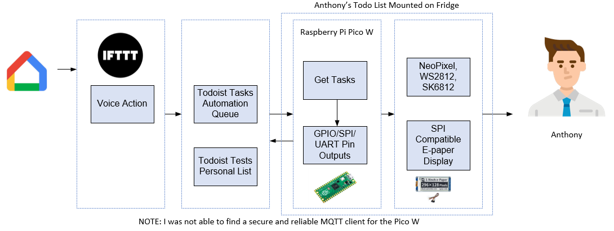

# Problem Statement

I need devices that show my TODO list in a few places in my house.

# Goal

Create a reference application that shows everything you need to configure a Raspberry Pi Pico W with an e-paper display using MicroPython. I need to be able to create a new task using Google Assistant

# Outcome

A GitHub repository with an application written in MicroPython that uses all of the best practices for security, encryption, and coding standards and documents any of the blockers that I face

# Architecture

-   Google Assistant integration using IFTTT
-   Tasks application and API using Todoist
    -   See issues with MQTT and Google Tasks API
-   MicroPython Application
-   Raspberry Pi Pico W
-   2.9-inch e-paper SPI-compatible display

## Logical Diagram



## Setup


## Tools

-   Siglent SDS 1202X-E Oscilloscope
-   Longwei LW-K3010D Benchtop Digital Switching DC Power Supply

# Issues

## MQTT client library

-   I was able to get the MQTT library to work
-   The library I found had a lot of bugs and would only work 30-40% of the time
-   I abandoned using MQTT for the Pico W because it was consuming too much project time.
-   I would prefer to use MQTT for the pub/sub features of the application, but it did not seem practical given the issues with the client library

## Google Tasks API

-   There are a lot of challenges with using the Google Tasks APIs (or many Google APIs) to work in my MicroPython application
-   Most of the Google APIs are now using OAuth 2.0. There is no way to get a long-live Personal Access Token (similar to Microsoft Azure or AWS)
-   You may create a Service Account, but it will not have access to your personal tasks data
-   You must use the gcloud CLI to generate a short-lived token
-   You must apply to Google with a YouTube video of your project to create a short-lived token with the required Scopes for Google Tasks API
-   After some thought, the Google Tasks application is very basic compared to other options, and I have decided to move all of my tasks to Todoist
-   Todoist allows a Personal Access Token (PAT) and has many features I can use for this project, like filtering tasks, etc.

## MicroPython

-   MicroPython is impressive if you worked with Microcontrollers 10-20 years ago. You were forced to write your application using a low-level language like assembly or machine code
-   If you have worked with full features frameworks like .Net Core or Java then MicroPython can be a bit frustrating
-   I did abandon a few best practices to speed up the development of my application. One example is that you can create modules for your libraries and import them into the main application. You will see from the GitHub history that you started using import but abandoned it. If there are any errors in your code, the stack trace will mask the root error and give you a bogus error that sends on a wild goose change

# Pico W

Pico W to E-Paper mapping

| **Signal** | **Pin** | **Position** | **E-paper** | **Description**                                     |
|------------|---------|--------------|-------------|-----------------------------------------------------|
| SCK        | GP10    | 14           |  CLK        | Serial Clock (SCK)                                  |
| MOSI       | GP11    | 15           |             | Master out Slave in (Probably time to rename these) |
| CS         | GP9     | 12           | CS          | Chip Select                                         |
| DC         | GP8     | 11           |             |                                                     |
| RST        | GP12    | 16           | RST         | Reset pin                                           |
| BUSY       | GP13    | 17           | BUSY        |                                                     |
| GND        | GND     | 18           | GND         |                                                     |

# Application

## 

## Settings

Create a config.py file with a settings object and a cipherkey string to be imported by the main.py application

settings = {

'ssid': '{your ssid for wifi}',

'pw': '{your wifi password}',

'token': 'Bearer {your todoist token}',

'tasksUrl': 'https://api.todoist.com/rest/v2/tasks'

}

\# key size must be 16 or 32

\# key = uos.urandom(32)

cipherkey = b'I_am_32bytes=256bits_key_padding'

```

```
